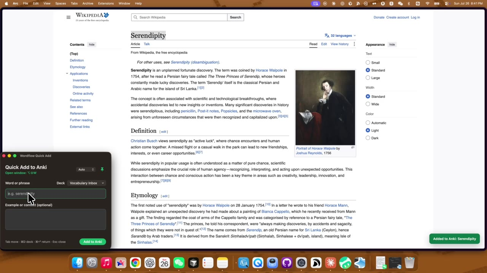
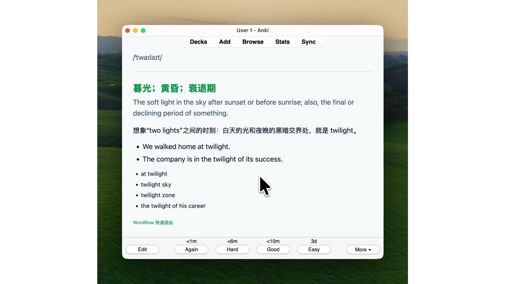

<p align="center">
  
</p>

<h1 align="center">Wordflow</h1>

<p align="center"><strong>Remember the words you actually encounter.</strong></p>
<p align="center">Collect → Understand → Review → Use</p>

<p align="center">
  <strong>English</strong> · <a href="README.zh-CN.md">简体中文</a>
</p>

<p align="center">
  <a href="https://chromewebstore.google.com/detail/wordflow-to-anki/digeekdaafggpmdaojgmpjkdbbkgkiga"><strong>Install from Chrome Web Store</strong></a>
  ·
  <a href="https://www.youtube.com/watch?v=ySq3NDcvDcQ"><strong>Watch the 38-second demo</strong></a>
</p>

<p align="center">
  
  
  
  
</p>

---

## Review with Anki. Capture with Wordflow.

[Anki](https://apps.ankiweb.net/) is a spaced-repetition app. It schedules vocabulary cards to return at gradually increasing intervals, helping you remember them for the long term.

Anki is great for review, but every vocabulary card still has to be entered by hand.

Wordflow lets you select or type a word, understand it in its original context, generate a compact learning card, and send it straight to Anki.

```text
Meet a word → Capture it once → Review on a schedule → Use it
```

I believe the best way to remember vocabulary is not to memorize an unfamiliar list, but to understand words in the real contexts where you encounter them, revisit them at the right time, and keep going until you can use them.

## Why Wordflow

- **Keep the real context, not an isolated definition.** Save the original sentence with the word and build the card around it.
- **A card tailored to each expression.** AI chooses the most useful content for a word, phrase, idiom, or collocation.
- **Almost no interruption.** Select and right-click, or press `Option + Shift + W` to open Quick Add.
- **Active recall in both directions.** Every capture creates both recognition and production cards.

Choose the card that matches your goal. **Full Learning** adds pronunciation, a clear meaning, 2–3 useful collocations, 1–2 reusable examples, and one compact learning note. **Exam Reading** keeps only the exact Chinese meaning of the word in its sentence, so you can move through reading material quickly without an overloaded card.

## See the whole learning loop

<table>
  <tr>
    <td width="50%" align="center">
      <a href="https://www.youtube.com/watch?v=ySq3NDcvDcQ">
        
      </a>
      <br>
      <strong>1. Capture and understand</strong><br>
      Select a word, keep its context, and turn it into two review-ready cards.
    </td>
    <td width="50%" align="center">
      <a href="https://www.youtube.com/watch?v=SslXMoeeIzc">
        
      </a>
      <br>
      <strong>2. Review and recall</strong><br>
      Let Anki schedule the cards until recognition becomes active recall.
    </td>
  </tr>
</table>

## Install

> Wordflow is an early macOS release. It requires Anki, AnkiConnect, Chrome or Arc, Python 3, and your own OpenAI API key. The extension is available from the Chrome Web Store; a small local companion connects it to Anki on your Mac.

### 1. Install the browser extension

[**Install Wordflow from the Chrome Web Store →**](https://chromewebstore.google.com/detail/wordflow-to-anki/digeekdaafggpmdaojgmpjkdbbkgkiga)

The same listing works in both Chrome and Arc.

### 2. Install Anki and AnkiConnect

1. Install and open [Anki](https://apps.ankiweb.net/).
2. Open **Tools → Add-ons → Get Add-ons**.
3. Enter `2055492159`, then restart Anki.

### 3. Install the local companion

#### Recommended: let a local AI coding agent install it

If you use Codex, Claude Code, or another AI coding agent with terminal access to your Mac, copy the entire prompt below. A chat-only AI cannot install local software for you.

```text
Please install the Wordflow local companion on this Mac:
https://github.com/yiyuke/wordflow-anki

Before making changes, read README.md and install.command so you understand what will be installed.
Use or update the main branch, run the repository's installer, and verify that:
1. the local Wordflow service is running on 127.0.0.1:8766;
2. the native Quick Add window opens;
3. the Chrome Web Store extension can connect to the local service.

Use the Chrome Web Store version of the extension. Do not load the extension from source unless I explicitly ask for a development installation.
Do not ask me to fork the repository, and do not ask me to paste my OpenAI API key into the chat.
Pause only for steps that I must complete myself, and give me clear step-by-step instructions:
- install or open Anki and add AnkiConnect (code: 2055492159);
- install the Wordflow extension from https://chromewebstore.google.com/detail/wordflow-to-anki/digeekdaafggpmdaojgmpjkdbbkgkiga;
- paste my own OpenAI API key into the hidden local terminal prompt so it is stored in macOS Keychain;
- approve a macOS security prompt if one appears.

When finished, test Option + Shift + W and Option + Shift + A, then tell me whether anything still requires manual action.
```

> Never paste your API key directly into an AI chat. Wordflow's configuration script accepts it through a hidden local prompt and stores it in macOS Keychain.

<details>
<summary><strong>Prefer not to use AI? Install the local companion manually</strong></summary>

### Download the source

There is not yet a tagged local-companion release. For the current version:

```bash
git clone https://github.com/yiyuke/wordflow-anki.git
cd wordflow-anki
```

### Run the installer

1. Double-click `install.command`.
2. Double-click the installed `configure-api-key.command` and paste your [OpenAI API key](https://platform.openai.com/api-keys).
3. If macOS blocks a script, Control-click it, choose **Open**, and confirm once.

</details>

## Use

| What you want to do | Action |
| --- | --- |
| Capture selected text in Arc or Chrome | Right-click **Add to Anki**, or press `Option + Shift + A` |
| Type a word from a PDF, Word, video, or podcast | Press the system-wide `Option + Shift + W` |
| Switch between detailed study and exam reading | Open the title-bar gear → **Learning Mode** |
| Choose an Anki deck | Press `Command + D` in Quick Add |
| Save and keep typing | Press `Enter` |
| Save and return to the previous app | Press `Command + Enter` |
| Pin or close Quick Add | Press `Command + P` or `Esc` |

The title-bar gear keeps learning mode, language, and the complete shortcut reference in one place. Wordflow remembers your choices. New cards start in `Vocabulary Inbox`; later deck choices are remembered too.

If Anki is not running when you save, Wordflow opens it in the background, waits for AnkiConnect, and safely completes the addition.

The question-mark button at the right of the macOS title bar opens an in-app feedback form, the project home, and a manual update check. Choose a feedback type, describe the issue, and submit it directly—no email app or contact details required. When a newer version is available, the button becomes a highlighted download button.

## Privacy and cost

Wordflow has no account, analytics, or advertising. Its optional feedback form uses Formspree to deliver only the type and description you choose to submit.

Your word and limited context go directly from your Mac to the OpenAI API; the finished card stays in your Anki collection.

Every installation uses its own OpenAI API key and pays for its own usage. See [PRIVACY.md](PRIVACY.md) and [SECURITY.md](SECURITY.md).

<details>
<summary><strong>How Wordflow works</strong></summary>

```text
Arc / Chrome extension ─┐
Native Quick Add window ├─→ Local Wordflow service → OpenAI API
Desktop / PDF input ────┘                         ↓
                                                AnkiConnect → Anki
```

Wordflow listens only on `127.0.0.1`. A strict JSON Schema keeps cards compact while the model chooses the most helpful explanation strategy. Li Jigang's [`ljg-word` Skill](https://github.com/lijigang/ljg-skills/blob/master/skills/ljg-word/SKILL.md) inspired one optional image-to-meaning technique; it is not a runtime dependency.

</details>

<details>
<summary><strong>Update, uninstall, and development</strong></summary>

The Chrome Web Store updates the browser extension automatically. To update the local companion, run `git pull` and run `install.command` again. To uninstall it, double-click `uninstall.command`; existing Anki cards remain untouched.

For extension development, open `arc://extensions` or `chrome://extensions`, enable **Developer mode**, choose **Load unpacked**, and select the repository's `extension` folder.

```bash
python3 -m unittest discover -s local_service/tests -v
node --check extension/service-worker.js
node --check extension/popup.js
native/build-app.sh
```

See [CONTRIBUTING.md](CONTRIBUTING.md), [CHANGELOG.md](CHANGELOG.md), the [launch kit](docs/LAUNCH.md), and the [Chrome Web Store submission kit](docs/CHROME_WEB_STORE.md).

</details>

## License

[MIT](LICENSE)
